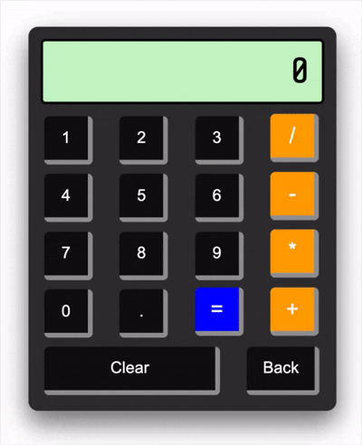

# JavaScript Calculator
 
A fully functional calculator built with vanilla HTML, CSS, and JavaScript as part of [The Odin Project](https://www.theodinproject.com/) Foundations curriculum.
 
## Live Demo
 
[View Live](https://geoclink.github.io/javascript-calculator)
 
## Features
 
- Basic arithmetic: addition, subtraction, multiplication, and division
- Chained calculations: result carries forward as the first number in the next operation
- Decimal support with duplicate decimal prevention
- Backspace button to undo last input
- Clear button to reset the calculator
- Keyboard support: use number keys, operators, `Enter` for equals, and `Backspace` to delete
- Divide by zero error handling
- Long decimal rounding to prevent display overflow
- 3D button press effect on click
## Built With
 
- HTML
- CSS (Flexbox, custom button effects)
- Vanilla JavaScript (DOM manipulation, event listeners)
## What I Learned
 
- Separating math logic from UI logic using dedicated functions
- Managing application state with variables across multiple event listeners
- The difference between object mutation and primitive copying in JavaScript
- How to handle edge cases like chained operations, divide by zero, and repeated equals presses
## Screenshots
 

 
## Author
 
George Clinkscales Jr.
- Portfolio: [geoclink.github.io/portfolio](https://geoclink.github.io/portfolio)
- GitHub: [@geoClink](https://github.com/geoClink)
 
